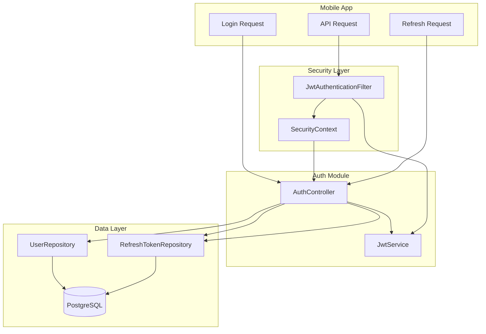
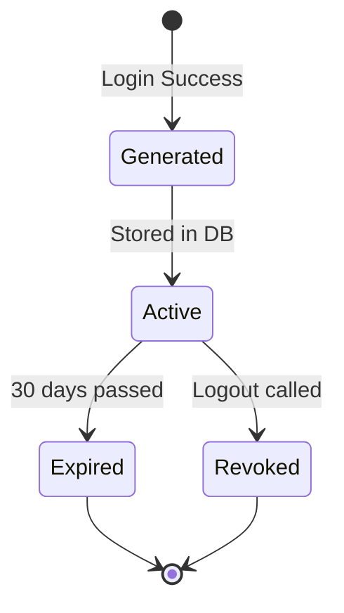

# Design Document: Backend Security Hardening

## Overview

Bu tasarım, MovieBackend uygulamasının güvenlik altyapısını üç katmanda güçlendirir:

1. **Zırhlanma Katmanı**: BCrypt hashing, environment-based secret key, refresh token persistence
2. **Çift Token Katmanı**: Access/Refresh token sistemi ve yenileme mekanizması
3. **Filtre Katmanı**: JWT doğrulama filtresi ve Security Context entegrasyonu

## Architecture



## Components and Interfaces

### 1. RefreshToken Entity

Veritabanında refresh token'ları takip eden JPA entity.

```kotlin
@Entity
@Table(name = "refresh_tokens")
data class RefreshToken(
    @Id
    @GeneratedValue(strategy = GenerationType.IDENTITY)
    val id: Long? = null,
    
    @Column(nullable = false, unique = true)
    val token: String,
    
    @ManyToOne(fetch = FetchType.LAZY)
    @JoinColumn(name = "user_id", nullable = false)
    val user: User,
    
    @Column(nullable = false)
    val expiresAt: Instant,
    
    @Column(nullable = false)
    val revoked: Boolean = false
)
```

### 2. RefreshTokenRepository

```kotlin
interface RefreshTokenRepository : JpaRepository<RefreshToken, Long> {
    fun findByToken(token: String): RefreshToken?
    fun deleteByUser(user: User)
}
```

### 3. JwtService (Güncellenmiş)

```kotlin
@Service
class JwtService {
    // Environment variable'dan oku, yoksa exception fırlat
    private val secretKey: SecretKey = initSecretKey()
    
    private fun initSecretKey(): SecretKey {
        val secret = System.getenv("JWT_SECRET")
            ?: throw IllegalStateException("JWT_SECRET environment variable must be set")
        return Keys.hmacShaKeyFor(secret.toByteArray(Charsets.UTF_8))
    }
    
    fun generateAccessToken(username: String): String  // 15 dakika
    fun generateRefreshToken(username: String): String // 30 gün
    fun extractUsername(token: String): String?
    fun isTokenValid(token: String): Boolean
}
```

### 4. JwtAuthenticationFilter

Spring Security filter chain'ine eklenen JWT doğrulama filtresi.

```kotlin
@Component
class JwtAuthenticationFilter(
    private val jwtService: JwtService,
    private val userRepository: UserRepository
) : OncePerRequestFilter() {
    
    override fun doFilterInternal(
        request: HttpServletRequest,
        response: HttpServletResponse,
        filterChain: FilterChain
    ) {
        // 1. Authorization header'dan Bearer token'ı çıkar
        // 2. Token geçerliyse username'i al
        // 3. User'ı bul ve SecurityContext'e set et
        // 4. Filter chain'e devam et
    }
}
```

### 5. AuthController (Güncellenmiş)

```kotlin
@RestController
@RequestMapping("/api/auth")
class AuthController {
    
    @PostMapping("/login")
    fun login(request: LoginRequest): ResponseEntity<LoginResponse>
    // Hem access hem refresh token döner
    
    @PostMapping("/refresh")
    fun refresh(request: RefreshRequest): ResponseEntity<TokenResponse>
    // Refresh token ile yeni access token al
    
    @PostMapping("/logout")
    fun logout(request: LogoutRequest): ResponseEntity<String>
    // Refresh token'ı revoke et
}
```

### 6. DTO'lar

```kotlin
data class LoginResponse(
    val accessToken: String,
    val refreshToken: String,
    val username: String
)

data class RefreshRequest(
    val refreshToken: String
)

data class TokenResponse(
    val accessToken: String
)

data class LogoutRequest(
    val refreshToken: String
)
```

## Data Models

### Database Schema

```sql
-- Mevcut app_users tablosu (değişiklik yok)
CREATE TABLE app_users (
    id BIGSERIAL PRIMARY KEY,
    username VARCHAR(255) UNIQUE NOT NULL,
    email VARCHAR(255) UNIQUE NOT NULL,
    password VARCHAR(255) NOT NULL  -- BCrypt hash
);

-- Yeni refresh_tokens tablosu
CREATE TABLE refresh_tokens (
    id BIGSERIAL PRIMARY KEY,
    token VARCHAR(512) UNIQUE NOT NULL,
    user_id BIGINT NOT NULL REFERENCES app_users(id),
    expires_at TIMESTAMP NOT NULL,
    revoked BOOLEAN DEFAULT FALSE
);

CREATE INDEX idx_refresh_tokens_token ON refresh_tokens(token);
CREATE INDEX idx_refresh_tokens_user_id ON refresh_tokens(user_id);
```

### Token Lifecycle




## Correctness Properties

*A property is a characteristic or behavior that should hold true across all valid executions of a system—essentially, a formal statement about what the system should do. Properties serve as the bridge between human-readable specifications and machine-verifiable correctness guarantees.*

### Property 1: BCrypt Password Round-Trip

*For any* plain text password, encoding it with BCrypt and then verifying the original password against the hash should return true, while verifying any different password should return false.

**Validates: Requirements 1.1, 1.2**

### Property 2: Token Expiration Correctness

*For any* generated token pair, the Access_Token's expiration claim should be approximately 15 minutes from issuance, and the Refresh_Token's expiration claim should be approximately 30 days from issuance.

**Validates: Requirements 4.2, 4.3**

### Property 3: Login Response Completeness

*For any* successful login, the response should contain non-empty accessToken, refreshToken, and username fields.

**Validates: Requirements 4.1, 4.4**

### Property 4: Refresh Token Persistence

*For any* successful login, querying the database for the returned refresh token should find a matching record associated with the logged-in user.

**Validates: Requirements 3.2**

### Property 5: Logout Revocation

*For any* valid refresh token, after calling logout with that token, the token's revoked status in the database should be true.

**Validates: Requirements 3.3, 8.1**

### Property 6: Revoked Token Rejection

*For any* revoked refresh token, attempting to use it for token refresh should fail with 401 status.

**Validates: Requirements 3.4, 5.3**

### Property 7: JWT Filter Authentication

*For any* request with a valid Bearer token, the SecurityContext should contain the authenticated user after filter execution. *For any* request without a token or with an invalid token, the SecurityContext should remain empty.

**Validates: Requirements 6.1, 6.2, 6.3**

### Property 8: Endpoint Protection

*For any* protected endpoint, unauthenticated requests should receive 401 status, while authenticated requests should receive a successful response (2xx status).

**Validates: Requirements 7.1, 7.2**

### Property 9: Valid Refresh Returns New Access Token

*For any* valid, non-revoked, non-expired refresh token, calling the refresh endpoint should return a new valid access token.

**Validates: Requirements 5.1**

## Error Handling

### Authentication Errors

| Scenario | HTTP Status | Response Body |
|----------|-------------|---------------|
| Invalid credentials | 401 | "Invalid password!" |
| User not found | 401 | "User not found!" |
| Missing JWT_SECRET | 500 | Application fails to start |
| Invalid token format | 401 | "Invalid token!" |
| Expired access token | 401 | "Token expired!" |
| Expired refresh token | 401 | "Refresh token expired!" |
| Revoked refresh token | 401 | "Refresh token revoked!" |
| Refresh token not found | 400 | "Refresh token not found!" |

### Exception Handling Strategy

```kotlin
@RestControllerAdvice
class AuthExceptionHandler {
    
    @ExceptionHandler(ExpiredJwtException::class)
    fun handleExpiredToken(ex: ExpiredJwtException): ResponseEntity<String> {
        return ResponseEntity.status(401).body("Token expired!")
    }
    
    @ExceptionHandler(JwtException::class)
    fun handleInvalidToken(ex: JwtException): ResponseEntity<String> {
        return ResponseEntity.status(401).body("Invalid token!")
    }
}
```

## Testing Strategy

### Property-Based Testing

Kotlin için **Kotest** property testing framework'ü kullanılacak.

```kotlin
// build.gradle.kts'e eklenecek
testImplementation("io.kotest:kotest-runner-junit5:5.8.0")
testImplementation("io.kotest:kotest-property:5.8.0")
```

Her property testi minimum 100 iterasyon çalıştırılacak ve design dokümanındaki property numarası ile etiketlenecek.

### Unit Tests

- BCrypt encoding/verification
- JWT token generation/validation
- Filter chain behavior
- Controller endpoint responses
- Repository operations

### Integration Tests

- Full login flow (register → login → access protected → refresh → logout)
- Database persistence verification
- Security filter chain integration

### Test Annotation Format

```kotlin
// Feature: backend-security-hardening, Property 1: BCrypt Password Round-Trip
@Test
fun `BCrypt encoding and verification round-trip`() {
    // Property test implementation
}
```
