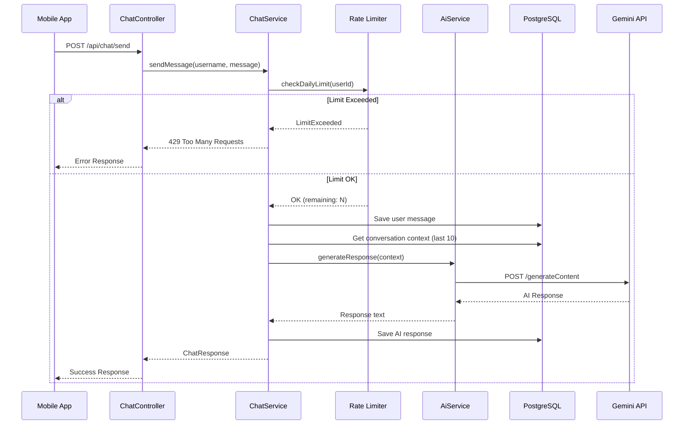

# Design Document: Gemini AI Chat

## Overview

Bu tasarım, kullanıcıların Gemini AI ile film/dizi hakkında sohbet edebilmesini sağlayan bir chat sistemi için backend implementasyonunu tanımlar. Sistem, Spring Boot üzerinde Kotlin ile geliştirilecek ve mevcut proje yapısına uyumlu olacaktır.

Temel bileşenler:
- **ChatMessage Entity**: Mesajları veritabanında saklayan JPA entity
- **ChatService**: İş mantığını yöneten servis katmanı
- **AiService**: Gemini API ile iletişim kuran servis
- **ChatController**: REST API endpoint'lerini sunan controller

## Architecture



## Components and Interfaces

### 1. ChatMessage Entity

```kotlin
@Entity
@Table(name = "chat_messages")
data class ChatMessage(
    @Id
    @GeneratedValue(strategy = GenerationType.IDENTITY)
    val id: Long? = null,
    
    @ManyToOne(fetch = FetchType.LAZY)
    @JoinColumn(name = "user_id", nullable = false)
    val user: User,
    
    @Column(nullable = false, columnDefinition = "TEXT")
    val content: String,
    
    @Enumerated(EnumType.STRING)
    @Column(nullable = false)
    val role: MessageRole,
    
    @Column(name = "created_at", nullable = false)
    val createdAt: LocalDateTime = LocalDateTime.now()
)

enum class MessageRole {
    USER, ASSISTANT
}
```

### 2. ChatMessageRepository

```kotlin
interface ChatMessageRepository : JpaRepository<ChatMessage, Long> {
    fun findByUserIdOrderByCreatedAtAsc(userId: Long): List<ChatMessage>
    
    fun findTop10ByUserIdOrderByCreatedAtDesc(userId: Long): List<ChatMessage>
    
    @Query("SELECT COUNT(m) FROM ChatMessage m WHERE m.user.id = :userId AND m.role = 'USER' AND m.createdAt >= :startOfDay")
    fun countUserMessagesTodayByUserId(userId: Long, startOfDay: LocalDateTime): Long
}
```

### 3. AiService Interface

```kotlin
interface AiService {
    fun generateResponse(conversationContext: List<ChatMessage>): AiResult<String>
}

sealed class AiResult<out T> {
    data class Success<T>(val data: T) : AiResult<T>()
    data class Error(val message: String, val code: AiErrorCode) : AiResult<Nothing>()
}

enum class AiErrorCode {
    API_ERROR, TIMEOUT, RATE_LIMITED, INVALID_RESPONSE
}
```

### 4. GeminiAiService Implementation

```kotlin
@Service
class GeminiAiService(
    private val restTemplate: RestTemplate
) : AiService {
    
    companion object {
        private const val GEMINI_API_URL = "https://generativelanguage.googleapis.com/v1beta/models/gemini-2.0-flash:generateContent"
        private const val SYSTEM_PROMPT = """
            Sen bir film ve dizi asistanısın. Kullanıcılara film ve dizi önerileri yapabilir,
            filmler hakkında bilgi verebilir, oyuncular ve yönetmenler hakkında konuşabilirsin.
            Türkçe yanıt ver. Kısa ve öz cevaplar ver.
        """
    }
    
    private val apiKey: String = System.getenv("GEMINI_API_KEY")
        ?: throw IllegalStateException("GEMINI_API_KEY environment variable must be set!")
    
    override fun generateResponse(conversationContext: List<ChatMessage>): AiResult<String> {
        // Build request with conversation history
        // Call Gemini API
        // Parse and return response
    }
}
```

### 5. ChatService

```kotlin
@Service
class ChatService(
    private val chatMessageRepository: ChatMessageRepository,
    private val userRepository: UserRepository,
    private val aiService: AiService
) {
    companion object {
        private const val DAILY_MESSAGE_LIMIT = 5
        private const val CONTEXT_MESSAGE_COUNT = 10
    }
    
    fun sendMessage(username: String, message: String): ChatResult<ChatResponse>
    fun getConversationHistory(username: String): ChatResult<List<ChatMessageResponse>>
    fun getRemainingQuota(username: String): ChatResult<QuotaResponse>
}

sealed class ChatResult<out T> {
    data class Success<T>(val data: T) : ChatResult<T>()
    data class Error(val message: String, val code: ChatErrorCode) : ChatResult<Nothing>()
}

enum class ChatErrorCode {
    USER_NOT_FOUND, LIMIT_EXCEEDED, AI_ERROR, VALIDATION_ERROR, INTERNAL_ERROR
}
```

### 6. ChatController

```kotlin
@RestController
@RequestMapping("/api/chat")
class ChatController(
    private val chatService: ChatService
) {
    @PostMapping("/send")
    fun sendMessage(
        @AuthenticationPrincipal userDetails: UserDetails,
        @RequestBody request: SendMessageRequest
    ): ResponseEntity<*>
    
    @GetMapping("/history")
    fun getHistory(
        @AuthenticationPrincipal userDetails: UserDetails
    ): ResponseEntity<*>
    
    @GetMapping("/quota")
    fun getQuota(
        @AuthenticationPrincipal userDetails: UserDetails
    ): ResponseEntity<*>
}
```

## Data Models

### Request/Response DTOs

```kotlin
// Requests
data class SendMessageRequest(
    val message: String
) {
    fun validate(): ValidationResult {
        return if (message.isBlank()) {
            ValidationResult.Invalid("Message cannot be empty")
        } else {
            ValidationResult.Valid
        }
    }
}

// Responses
data class ChatResponse(
    val userMessage: ChatMessageResponse,
    val aiResponse: ChatMessageResponse,
    val remainingQuota: Int
)

data class ChatMessageResponse(
    val id: Long,
    val content: String,
    val role: MessageRole,
    val createdAt: LocalDateTime
)

data class QuotaResponse(
    val used: Int,
    val limit: Int,
    val remaining: Int
)

data class ErrorResponse(
    val error: String,
    val code: String,
    val timestamp: LocalDateTime = LocalDateTime.now()
)
```

### Database Schema (Flyway Migration)

```sql
-- V6__create_chat_messages_table.sql
CREATE TABLE chat_messages (
    id BIGSERIAL PRIMARY KEY,
    user_id BIGINT NOT NULL REFERENCES users(id) ON DELETE CASCADE,
    content TEXT NOT NULL,
    role VARCHAR(20) NOT NULL,
    created_at TIMESTAMP NOT NULL DEFAULT CURRENT_TIMESTAMP
);

CREATE INDEX idx_chat_messages_user_id ON chat_messages(user_id);
CREATE INDEX idx_chat_messages_user_created ON chat_messages(user_id, created_at);
```

## Correctness Properties

*A property is a characteristic or behavior that should hold true across all valid executions of a system-essentially, a formal statement about what the system should do. Properties serve as the bridge between human-readable specifications and machine-verifiable correctness guarantees.*

### Property 1: Message Persistence Round-Trip

*For any* valid chat message sent by a user, saving the message to the database and then retrieving the conversation history should return a list containing that message with the correct content, role, and user association.

**Validates: Requirements 1.1, 1.4**

### Property 2: Conversation History Ordering

*For any* set of chat messages created at different times for a user, retrieving the conversation history should return messages ordered by created_at in ascending order.

**Validates: Requirements 1.4**

### Property 3: Daily Limit Enforcement

*For any* user who has sent N messages today where N >= 5, attempting to send another message should result in a 429 error without calling the AI service, and the remaining quota should be 0.

**Validates: Requirements 2.2, 2.5**

### Property 4: Quota Calculation Consistency

*For any* user who has sent N messages today where N < 5, the remaining quota should equal (5 - N), and the user should be able to send a message successfully.

**Validates: Requirements 2.5**

### Property 5: Conversation Context Limit

*For any* user with more than 10 messages in their history, when calling the AI service, only the last 10 messages should be included in the conversation context.

**Validates: Requirements 3.3**

### Property 6: Authentication Requirement

*For any* chat endpoint (send, history, quota), calling without a valid JWT token should return 401 Unauthorized.

**Validates: Requirements 4.4, 5.1**

### Property 7: Empty Message Validation

*For any* string composed entirely of whitespace or empty string, attempting to send it as a message should return 400 Bad Request and the message should not be saved.

**Validates: Requirements 4.5, 5.3**

## Error Handling

### Error Response Format

Tüm hatalar aşağıdaki formatta dönülecektir:

```kotlin
data class ErrorResponse(
    val error: String,      // Kullanıcı dostu hata mesajı
    val code: String,       // Hata kodu (LIMIT_EXCEEDED, VALIDATION_ERROR, vb.)
    val timestamp: LocalDateTime
)
```

### Error Scenarios

| Scenario | HTTP Status | Error Code | Message |
|----------|-------------|------------|---------|
| Token yok/geçersiz | 401 | UNAUTHORIZED | "Authentication required" |
| Günlük limit aşıldı | 429 | LIMIT_EXCEEDED | "Daily message limit reached. Upgrade to Premium for unlimited access." |
| Boş mesaj | 400 | VALIDATION_ERROR | "Message cannot be empty" |
| Gemini API hatası | 503 | AI_SERVICE_ERROR | "AI service is temporarily unavailable. Please try again later." |
| Gemini timeout | 503 | AI_TIMEOUT | "AI service timed out. Please try again." |
| Beklenmeyen hata | 500 | INTERNAL_ERROR | "An unexpected error occurred" |

### Retry Strategy

- Gemini API hataları için otomatik retry yapılmayacak
- Client tarafında retry mantığı implement edilecek
- Timeout süresi: 30 saniye

## Testing Strategy

### Unit Tests

Unit testler aşağıdaki senaryoları kapsayacaktır:

1. **ChatService Tests**
   - Mesaj kaydetme işlemi
   - Günlük limit kontrolü
   - Kota hesaplama
   - Conversation history sıralama

2. **Validation Tests**
   - Boş mesaj validasyonu
   - Whitespace-only mesaj validasyonu

3. **AiService Tests (Mock)**
   - Başarılı API yanıtı parse etme
   - Hata yanıtı handle etme
   - Timeout durumu

### Property-Based Tests

Property-based testler için **Kotest** framework'ü kullanılacaktır.

```kotlin
// build.gradle.kts'e eklenecek
testImplementation("io.kotest:kotest-runner-junit5:5.8.0")
testImplementation("io.kotest:kotest-property:5.8.0")
```

Her property testi minimum 100 iterasyon ile çalıştırılacaktır.

Test annotation formatı:
```kotlin
// Feature: gemini-ai-chat, Property 1: Message Persistence Round-Trip
// Validates: Requirements 1.1, 1.4
```

### Integration Tests

1. **Endpoint Tests**
   - POST /api/chat/send - başarılı mesaj gönderimi
   - GET /api/chat/history - conversation history
   - GET /api/chat/quota - kota sorgulama
   - Authentication kontrolü

2. **Database Tests**
   - Mesaj kaydetme ve okuma
   - Index performansı

